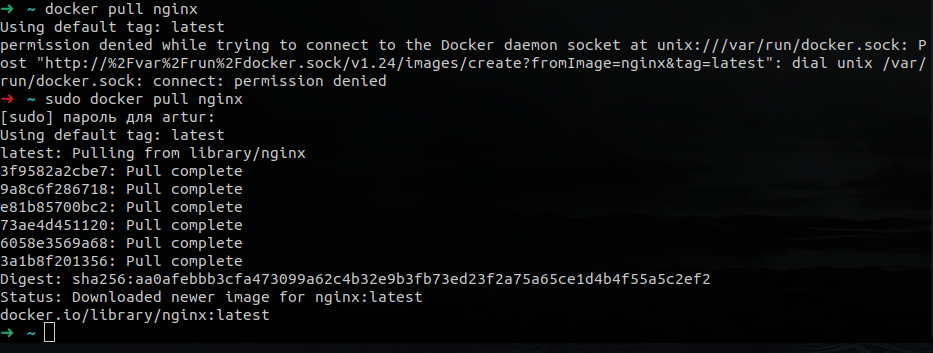
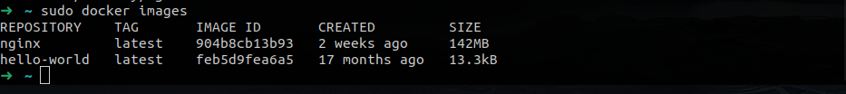
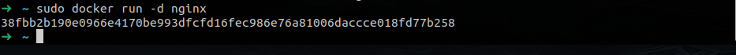
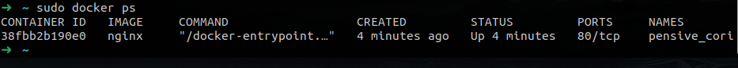
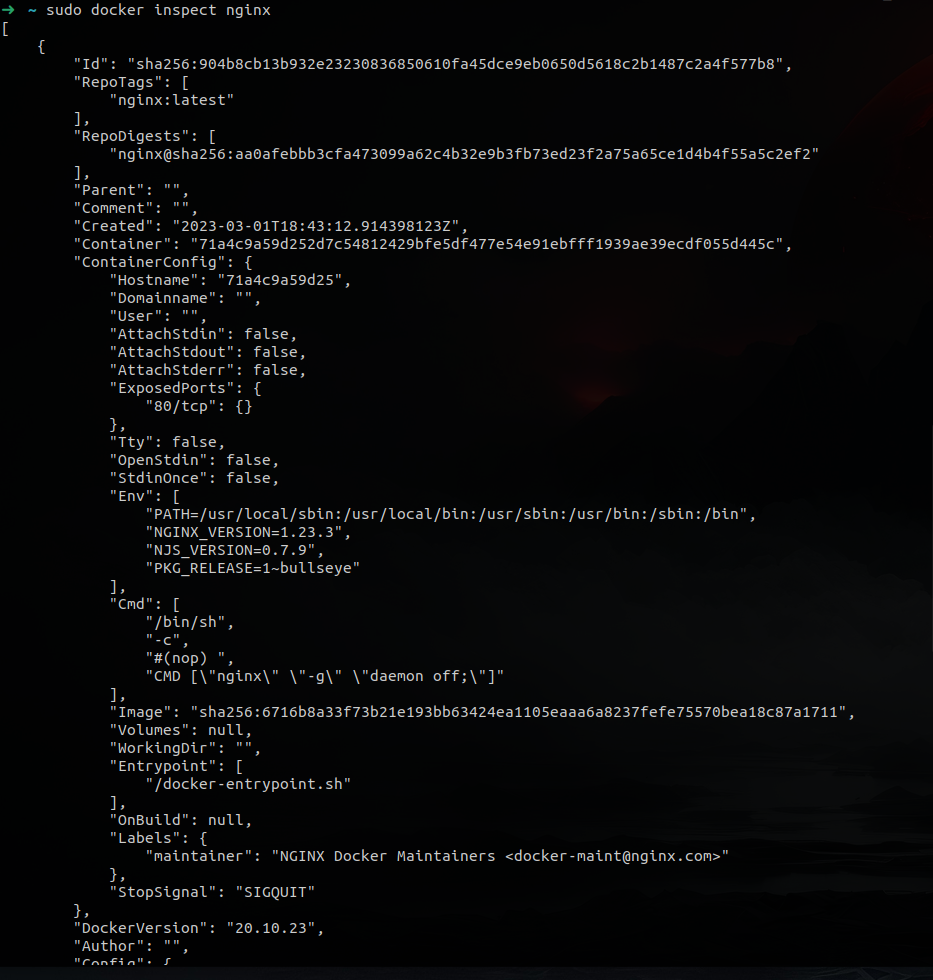
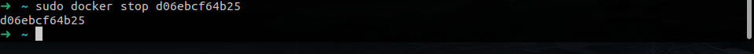
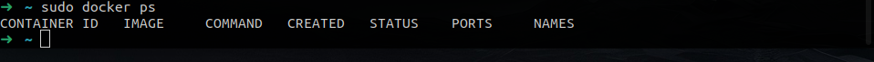
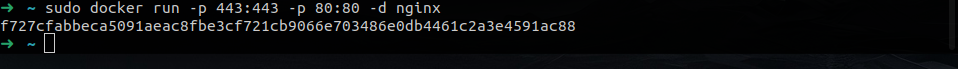
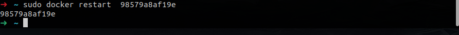
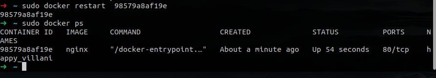

## Part 1. Ready-made docker

- `docker pull nginx`

- Check `nginx` for exist

- Run `nginx`

- Check `nginx` if it`s running

- Inspect `nginx`

- Size: 141838643, port: 80, где ip хз

- Stopping `nginx` and `ps`

- Mapping

- Start page `nginx`

- Restart `nginx`

- Check restart

