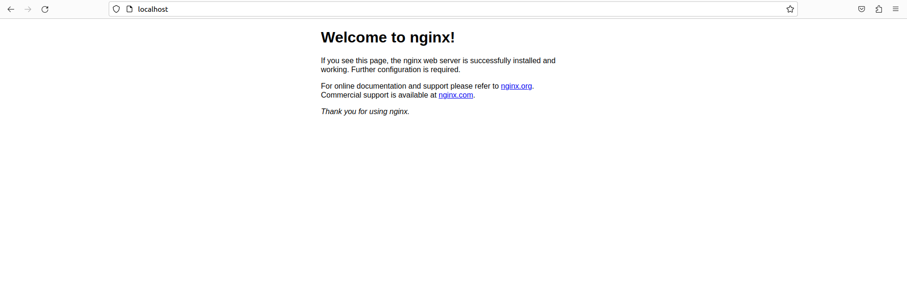
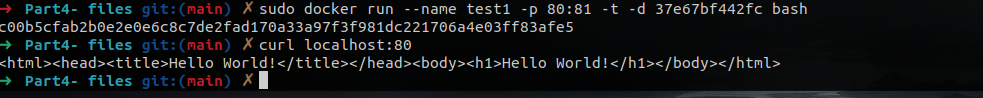

## Part 1. Ready-made docker

- `docker pull nginx`

- Check `nginx` for exist

- Run `nginx`

- Check `nginx` if it`s running

- Inspect `nginx`

- Size: 141838643, port: 80, где ip хз

- Stopping `nginx` and `ps`

- Mapping

- Start page `nginx`

- Restart `nginx`

- Check restart

## Part 2. Operations with container

- Read the `nginx.conf` configuration file inside the docker image with the `exec` command

- Copied nginx.conf

- Reloaded `nginx` (Чтобы достучаться с локальной машины нужно замаппить порты)

- Stopped and checked stop

- Removed image and stopped container

- Import image and run

## Part 3. Mini Web-server

- Web-server on C

- New nginx.conf with fastcgi add-on

- Actions inside the container
  

- Page in browser with `Hello World`

## Part 4. Your own docker
 
- Building docker container 

- Running container

