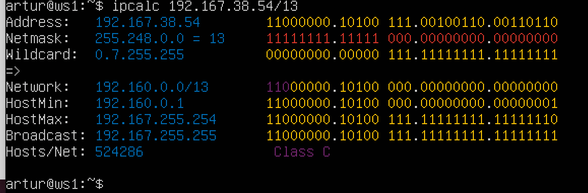

## Part 1. Инструмент ipcalc

### 1.1

1. Адрес сети 192.167.38.54/13.
   

    Адрес указывается в поле Network - 192.160.0.0/13
2. Перевод маски 255.255.255.0 в префиксную и двоичную запись, /15 в обычную и двоичную, 
    11111111.11111111.11111111.11110000 в обычную и префиксную.
    - `255.255.255.0` = `/24` в префиксной и  `11111111.11111111.11111111.00000000` в двоичной записи.
    - `/15` = `11111111.11111110.00000000.00000000` в двоичной и `255.254.0.0` в десятичной записи.
    - `11111111.11111111.11111111.11110000` = `/28` в префиксной и `255.255.255.240` в десятичной записи.
3. Минимальный и максимальный хост в сети 12.167.38.4 при масках: /8, 11111111.11111111.00000000.00000000, 
    255.255.254.0 и /4.
    - С маской `/8`. Минимальный - `12.0.0.1`, максимальный - `12.255.255.254`
    - С маской `11111111.11111111.00000000.00000000 (/16)`. Минимальный - `12.167.0.1`, максимальный - `12.167.255.254`
    - С маской `255.255.254.0 (/23)`. Минимальный - `12.167.38.1`, максимальный - `12.167.39.254`
    - С маской `/4`. Минимальный - `0.0.0.1`, максимальный - `15.255.255.254`
### 1.2
    

