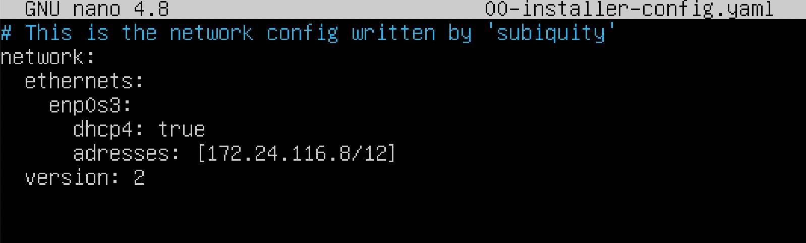

## Part 1. Инструмент ipcalc

### 1.1

1. Адрес сети 192.167.38.54/13.
   

    Адрес указывается в поле Network - 192.160.0.0/13
2. Перевод маски 255.255.255.0 в префиксную и двоичную запись, /15 в обычную и двоичную, 
    11111111.11111111.11111111.11110000 в обычную и префиксную.
    - `255.255.255.0` = `/24` в префиксной и  `11111111.11111111.11111111.00000000` в двоичной записи.
    - `/15` = `11111111.11111110.00000000.00000000` в двоичной и `255.254.0.0` в десятичной записи.
    - `11111111.11111111.11111111.11110000` = `/28` в префиксной и `255.255.255.240` в десятичной записи.
3. Минимальный и максимальный хост в сети 12.167.38.4 при масках: /8, 11111111.11111111.00000000.00000000, 
    255.255.254.0 и /4.
    - С маской `/8`. Минимальный - `12.0.0.1`, максимальный - `12.255.255.254`
    - С маской `11111111.11111111.00000000.00000000 (/16)`. Минимальный - `12.167.0.1`, максимальный - `12.167.255.254`
    - С маской `255.255.254.0 (/23)`. Минимальный - `12.167.38.1`, максимальный - `12.167.39.254`
    - С маской `/4`. Минимальный - `0.0.0.1`, максимальный - `15.255.255.254`
    - 
### 1.2

Мы можем обратиться к приложению, запущенному на `localhost`, если его адрес находится в пространстве адресов
`127.0.0.0 — 127.255.255.255`

   - `194.34.23.100` не можем.
   - `127.0.0.2` можем.
   - `127.1.0.1` можем.
   - `128.0.0.1` не можем.

### 1.3

1. Приватные адреса начинаются со следующих чисел - 10, 127, 169, 172, 192. Все остальные IP относятся к публичным.
   - `10.0.0.45` - частный.
   - `134.43.0.2` - публичный.
   - `192.168.4.2` - частный.
   - `172.20.250.4` - частный.
   - `172.0.2.1` - публичный.
   - `192.172.0.1` - публичный.
   - `172.68.0.2` - публичный.
   - `172.16.255.255` - частный.
   - `192.169.168.1` - публичный.

2. Шлюз-это сетевое устройство, которое действует как точка входа из одной сети в другие сети. 
   Хост отправляет в сетевой шлюз по умолчанию (в частности, на IP-адрес сетевого шлюза) все пакеты,
   направленные на другие хосты вне локальной сети, 
   что означает, что хост без указанного адреса шлюза по умолчанию может обмениваться пакетами 
   только с компьютерами в той же локальной сети.

   В связи с распространением сети TCP/IP 
   понятие сетевого шлюза стало практически тождественным маршрутизатору. 
   Шлюз создается на границе сети для управления всеми данными, 
   которые обмениваются между внутренней сетью и внешними сетями.

   Из перечисленных IP адресов шлюза возможны у сети `10.10.0.0/18`:
   `10.10.0.2`, `10.10.10.10`,  `10.10.1.255`.

## Part 2. Статическая маршрутизация между двумя машинами

- Для первой машины ip a
   

- Для второй машины ip a
  

### Изменение адресов

- WS1
  
- WS2
  

- `netplan apply`
  - WS1
    
  - WS2
    

### 2.1

- `ip r add(ws1)`
   

- `ip r add(ws2)`
  

### `ping`
- WS1
  
- WS2
  

Для того чтоб связать я переключил настройки сети виртуальных машин на `internal network` (теперь нет выхода в интернет)
и вручную изменил кофигурационные файлы:
 

(для второй машины аналогично)

#### `Для удобства сделал второй сетевой интерфейс на каждой машине(для этого выключил) и добавил адаптер с конфигурацией NAT и добавл в конфиг файл`

## Part 3. Утилита iperf3

### 3.1
- `8 Mbps = 1 MB/s`
- `100 MB/s = 800000 Kbps`
- `1 Gbps = 1000 Mbps`

### 3.2
`iperf3` запускается на двух машинах. На ws2 в качестве сервера, на ws1 в качестве клиента.
- WS1 - клиент
  
- WS2 - сервер
  

